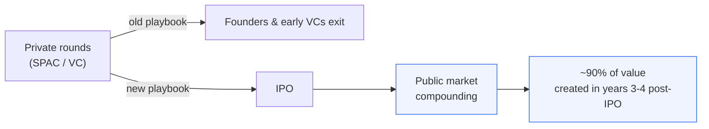

本文用 [paper-craft-skills](https://github.com/zsyggg/paper-craft-skills) 的 **paper-analyzer（精炼型）** 流程，对 All-In 播客最新一期做「速览」——保留信息密度，去掉铺垫。原始转录来自 [Happy Scribe](https://podcasts.happyscribe.com/all-in-with-chamath-jason-sacks-friedberg/the-ipo-comeback-why-tech-giants-are-finally-going-public-all-in-liquidity-ipo-panel)。

> 🎙️ **来源**：All-In with Chamath, Jason, Sacks & Friedberg —— *"The IPO Comeback: Why Tech Giants Are Finally Going Public | All-In Liquidity IPO Panel"*，时长 32:28，发布于 2026-06-06。
>
> ⚠️ **非投资建议。** 文中价格、市值与数据均为嘉宾在节目中口述，仅供学习研究，不构成任何买卖建议。

---

## 一图看懂：价值在哪一段创造

## TL;DR

科技公司重新拥抱 IPO。圆桌共识：**真正的复利发生在上市之后**——Cerebras 与 Planet Labs 都在公开市场拿到了 10x，而非私募轮。AI 把「上市即终点」的旧叙事彻底翻转了。

**嘉宾阵容：**

| 角色 | 嘉宾 | 公司 |
|------|------|------|
| 主持 | Chamath Palihapitiya | All-In |
| AI 芯片 | Andrew Feldman | Cerebras Systems（CEO） |
| 太空数据 | Will Marshall | Planet Labs（联合创始人 / CEO） |
| 投资人 | Brad Gerstner | Altimeter Capital（创始人 / CEO） |

## 核心要点

**1. IPO 当天没那么神圣，基本面才是。**
Feldman 直言上市路演里大量会议毫无价值——"你看着 Zoom，130 个与会者……零增量"。敲钟那天员工很激动，但供应商关系、运营现实第二天一模一样。关于「踩对时点」，他的总结是反鸡汤的：

> "The answer is by getting it wrong for a decade. That's really the right way to get timing right." —— Andrew Feldman

**2. 钱主要在 IPO 之后赚——这是全场最强论点。**
Gerstner 把旧叙事推翻：

> "More money is made after IPO than before… the opportunity to make vastly more is after IPO, not before." —— Brad Gerstner

证据就在桌上：Cerebras 上市仅三周市值已 $50–60B；Planet Labs 一年内从 $5 涨到 $50（10x），且 9 成价值发生在上市后第 3–4 年。两位 CEO 都主张**上市后继续持有**。

**3. 不要造一块「更好的 GPU」。**
Cerebras 的架构哲学是把内存贴着算力放——一块"餐盘大小"的芯片，直接解决数据搬运瓶颈，对 GPU 拿到 15–18x 的速度优势。Feldman 给后来者的警告很硬：

> "If you build a GPU, the odds that you're better than NVIDIA are approximately zero." —— Andrew Feldman

底层动机是实时推理："You will not wait for AI. We have to deliver it to you in real time."

**4. 太空与 AI 是「天作之合」。**
Marshall 认为二者正在"结婚"。逻辑链：AI 只和它训练的数据一样好（"AI is only as good as the data it's trained upon"），而 Planet 的 ~200 颗卫星正是地球观测数据的源头，~60% 收入来自安防 / 军事。更激进的是**太空数据中心**——当发射成本从今天的 ~$1,000/kg 降到 $200–300/kg（过去十年已降 10x，预计再过 2–3 年触及），叠加太阳同步轨道上 5x 的光伏效率，在轨算力就开始划算。

**5. 难是常态，易是奇点。**
Chamath 对创业曲线的概括，适用于在场每一家：

> "Everything was really hard until it got really easy—like 9 and a half years of really hard and then 12 months of really easy." —— Chamath Palihapitiya

## 核心数据表

| 主题 | 关键数字 | 解读 |
|------|---------|------|
| Cerebras IPO | 定价 $185 → 开盘 $320 → 现价 ~$230 | 上市三周，市值 $50–60B |
| Cerebras 性能 | 比 GPU 快 **15–18x** | 内存贴算力，破解搬运瓶颈 |
| Planet Labs | $5 → $50（**10x / 12 个月**） | 涨幅几乎全在公开市场 |
| Planet 规模 | ~200 颗卫星，~60% 收入来自安防/军事 | 对应 $75–100B 地球观测市场 |
| 发射成本 | ~$1,000/kg → 目标 $200–300/kg | 跌破阈值后太空数据中心成立 |
| 价值分布 | IPO 后第 3–4 年贡献 **~90%** 价值 | 「上市后才是大头」的量化注脚 |

---

**一句话**：上市不是终点，是复利的起点——而下一个十年的复利，可能是在轨道上算出来的。

---

## 原始转录（全文）

> 📝 以下为该期节目的**完整原始转录**（约 32 分钟，~5,500 词），来源 [Podscripts](https://podscripts.co/podcasts/all-in-with-chamath-jason-sacks-friedberg/the-ipo-comeback-why-tech-giants-are-finally-going-public-all-in-liquidity-ipo-panel)，由机器自动转写，**未经人工校对**，可能存在错词（如把 *Cerebras* 转成 "Cerebris"、*Feldman* 转成 "Baldwin"、*Gerstner* 转成 "Gersner" 等）。时间戳为分段起点。仅供查阅，正文中的引用已按实际语义校正。

**[00:00:00]** Hey, 2026 could be an all-time record for IPOs. The AI IPO of the year so far. That company is Cerebris. Cerebris Systems founder and CEO Andrew Baldwin. We are participating in something extraordinary. On everything we do, we are the fastest bar none. Will Marshall is the co-founder and CEO of Planet Labs. Space and AI are really a match made in heaven.

**[00:00:24]** They're getting married, in fact. Just like Google figured out how to index the internet and make it search of it. We are indexing the earth and making it such a ball. He's got his glasses, the famous red glasses, Brad Gersner's here, founder and CEO of Automotive Capital, a leading tech investment firm. I believe that the wave is the biggest wave in the history of technology will be incredibly beneficial for America. I'm rooting for all of them because I'm rooting for America.

**[00:00:50]** Ladies and gentlemen, please welcome Brad Gersner, Will Marshall, and Andrew Feldman. on the couch we switched it up I'm just to see you my guy hey I'm happy boy nice to see you

**[00:01:09]** last time I saw you we were in Davos yes we were in Davos causing trouble another name drop another J-Kell do you know that little Davos? Yeah we're just you know

**[00:01:18]** it was pre-IPO we're chopping it up just Davos we're in Davos hanging out of Davos Well no listen I was Everybody knows the story I'm supposed to go on my yearly Japan ski trip

**[00:01:28]** Sacks calls me With Tucker? Yeah, well, anyway, we don't drop that name, but I'll pick it up for you, put it over here. Anyway, so I cancel on Tucker. I cancel Schenchercher because Sacks calls me, he says, listen, POTUS needs you, the world's greatest moderator in Davos. No problem. Tucker, Sacks, POTUS, and Davos. So I said, when?

**[00:01:48]** He says, in three days. I say, you got it. I go, and they give me a badge, and it's like the special green badge, and they buzz you through the security. and I look at the monitor and it says, Jason McCabe Calacanis with Donald J. Trump. Oh, wow. How did you feel? I thought it was hilarious.

**[00:02:10]** So then I went and we did a great interview there and we did like six or seven of these great All-In interviews and it was fun. Let's start this because the two of you guys run two of the most interesting and consequential newly public companies in the stock market. Andrew Feldman is the founder and CEO of Cerebrus. Well, Marshall is the founder and CEO of Planet Labs,

**[00:02:29]** but you are also the insight and a gateway for all of us to understand these two big trends. One is in AI Silicon. The other one is in space data centers. I think it would be a really interesting thing to... And emerging. And emerging, yeah. But let's just take one step back.

**[00:02:47]** You just heard the last conversation about being public, going public early. Let's just talk about that because I'm just very curious. How's it been? It's been three weeks or so for you. It's been about a year and a half. or two years for you. Was it everything that you thought it would be? What's clear so far as I need to upgrade my name drop game.

**[00:03:08]** That was a tour to force. But by the way, you were in Davos with J-Cal. I was there, but that... Two-to-force. Look, I think you do all this work, and I think it's really difficult to over-escent. the amount of garbage that's involved in going public, the number of meetings where you look on the Zoom and there are 130 attendees and the amount of times you review these documents

**[00:03:42]** and the commas move and just no values added. You go there and you have this enormous event and the next morning you've sold no more stuff. Your engineering projects have made no progress since the day you weren't public, and you go back to work. And you have some new constituents that you have to address and communicate with. But the core parts of your business, you have more money in the bank, but not a damn thing changes in the important parts of your business. If you need new supply or if your relationships with your vendors are bad, they're still bad. If they're good, they're still good. And so I think what we've seen is your employees have a

**[00:04:33]** party, everybody's really excited, you put your head back down, you high five, and you go back to work. Can I just give a little context, and then I want to hear from Will. You know, if I can, Andrew, you know, we were investors in Cerebrus. I was on the board a year earlier where we were trying to go public. And, you know, aside from just being a warrior who weathered a decade worth of storms that would have taken out any normal human being, the path to going public for Cerebrus was a particularly challenging one. One of their investors was the UAE's, so there was questions about Sipheus, you know, in the prior, under the Biden administration, challenging to get public. My observation outside looking in is everything was really hard until it got really easy.

**[00:05:24]** Like nine and a half years of really hard and then 12 months of really easy where everybody wanted to get in. They priced the IPO at 185, which was up, the range was taken up two times. Okay. The stock opened at $320 a share, I think. Today it's at $230 a share, 50, $60 billion. in market cap. For a business like, you know, and Andrew is just one of these people, let's get back

**[00:05:53]** to work and build shit. But my just add-on question to that is from an employee morale perspective, like distraction perspective, et cetera, has the last three weeks you've got a lot more capital, you've got a lot more profile, presumably it's easier to sell to enterprise customers today. Net net, if you were advising me, if I was in a similar position, would you say go public? I think the first thing is a lot of people asked us about how we got the timing right. Right. And I think the answer is by getting it wrong for a decade.

**[00:06:26]** That's really the right way to get timing right. I think first, we've been at this for more than a decade, and we brought everybody who'd been with the company more than nine years to share, and we brought their families. And first, I learned that engineers own ties. I didn't actually know that. And they didn't die when they wore them. And second, I was surprised at how big a deal it was for them and their family.

**[00:06:56]** They're really proud in a way that sort of their parents might have heard of it or that somehow this was like a bar mitzvah or quinceanera or something. And then you had the sort of the children of immigrants, one of our leaders, her father, Chinese immigrants, said, I thought it would have happened faster. Right. But I think we are sort of by nature sort of in the trenches people.

**[00:07:37]** And so we love solving hard problems. And so when we had this excitement, everybody went and they were so excited. and we had a party, and I think it gave external validation, and then everybody turned around and said, now what are we, now back to work. And so I think... And so you started off kind of bang right out of the gates.

**[00:08:02]** Will, you had a little bit different experience in terms of, you know, the entry to the public markets, but over the last 12 months, your stock has gone from $5 a share to $50 a share, some 10x move, in the public markets. So talk us through the other side of this, where you come public, nobody really notices until they notice. Well, we were one of the first space stocks, and I think people just had no idea.

**[00:08:27]** Earth is going on in space, how it was changing everything, and they were just like, what the heck is that? But, you know, I have similar opinions. I mean, in the end, you've just got to get on with executing the business. Going public gives you access to liquidity for early shareholders.

**[00:08:44]** whether that's early employees or early investors, and that's great. It gives you cash for the company. That's great. And I do think it helps your business as well, because the maturing event gives you more credibility to various customers. And for us, we work with biggest agricultural customers, big governments, civil governments, defense and intelligence, all of those sort of actors.

**[00:09:09]** They want to know you're going to be around. Exactly. And not going to disappear. I mean, we have countries that are fully dependent on us giving them information. They don't want to just disappear, so they really care that we're going to be around. And being a public company gives you the kind of force in the world

**[00:09:23]** that people go, okay, you're here to stay, and you have access to capital if you need it, and so on. It's legitimizing that. And, you know, where the stock is any one day, you know, we're not focused on that day-to-day. We're focused on how we build long-term value for our shareholders, right? And, you know, the market is, I think, started to really understand where space is going,

**[00:09:44]** why it is changing the world. You know, people forget how space is part of your everyday life. Every time you use a phone, you're using communications using satellites or GPS using satellites or satellite data in some way or another that's sort of integrated in your lives. You may not realize it, but it's just booming now. There's a-

**[00:10:07]** And the story's changed as well, obviously with SpaceX going public, but has the framing of planet gone from like a data source for people who need data from space and maps to, hey, this is a tool to accomplish tasks and military. Like post-Andral success, like you probably would have been bucketed into andralize a military tech company. So is that framing what's driving a lot of that? Well, I think it's a bit more nuanced than that. I mean, firstly, for the audience's benefit.

**[00:10:36]** What planet does, we have satellites doing Earth imaging. We have the largest Earth imaging fleet, about 200 satellites. the image, the entire Earth every day. So think of it like the Google satellite lay on Google Maps that you can look at, except it's today's date rather than three years old, and we have every day going back. So it's a time series analysis of everything going on on the Earth. That's useful for farmers.

**[00:10:58]** It's useful for energy companies. It's useful for civil governments, for flooding and fires. It's useful for security applications like you're getting at. And it's a wide variety of use cases. I think that where we're seeing this is that AI is now enabling the, it's basically reducing the barrier to entry so that more people can get access to this, right? And, you know, there's a lot more to say on that, but AI is only as good as the data it's trained upon.

**[00:11:28]** What percentage is military, I'm curious. What percentage of revenue customer base? It's about 60% of our revenue today. Security is part of the initial thing that we said we would do out of the gate, but it's true. this a bigger fraction today than perhaps we would have guessed. But the needs of the geopolitical situation right now demand what we're doing. Just as an example, what this does is enable them to see threats around the corner. Yes. And then, you know, give them weeks or months advance warning of things. And then that enables them to more likely do things that stop conflict. So we

**[00:12:04]** believe this is, you know, really better for the world. Are you reticent to be perceived as a military company? Not really, but I wouldn't say we're limited to being perceived like that, right? We are helping farmers, we are helping, you know, energy companies, civil governments, we work with NASA, we work with, what have you. And so it's a bigger, it's a bigger play than that. But back to the space piece of it, what has changed, obviously rocket costs have come down about four or five X over the last 10 years, which has helped tremendously. But a thing that people don't know that is actually perhaps more important is that we've had a miniaturization of satellites so that the same satellite that used to cost a billion dollars and weighed 20 tons

**[00:12:51]** now costs a few kilograms or a few tens or hundreds of kilograms and can do just as much stuff, if not more. It's the same as the sort of mainframe computer to desktop revolution for space and it's unlocking, just like mainframes to desktops, unlock loads of applications. This is unlocking loads of applications. And so both go in combo. The launch costs coming down and this. Let's build on this.

**[00:13:17]** So I think I'd like, first you maybe take a few minutes, and then I want to talk to Andrew the same question. Both of you guys are at the foot of what are probably huge secular trends in technology. How I would frame this is we are rebuilding the data processing infrastructure. that has existed on the earth in the sky. And first you do the satellites, but I would love for you to explain space-based data centers, because I think everybody's hearing about that. Are they really viable? What are they?

**[00:13:49]** How will they work, et cetera? And then, Andrew, this is the rebirth of silicon. We're going to find the next version of Moore's Law, which I think is more time-bounded, not transistor density-bounded. We now hear a lot about domain-specific architectures. We hear, I mean, your chip was just a complete transformation in terms of the design principles that, you know, like at Grok, we took a very different approach,

**[00:14:14]** Nvidia's taken a very different approach. You took a big pizza-shaped dye and said, fuck it, Yolo, this is it, and you were right. Just explain where we're going in Silicon. So maybe, Will you start, and then Andrew, you start? I mean, what we're seeing, firstly, in space, is all these new applications based on data and AI. So, you know, we're collecting vastly more data about the planet.

**[00:14:36]** And with SpaceX and Starlink and OneWeb, they're transporting far more data around the planet. As you say, we're sort of changing the nature of data using satellites. And that's basically doing what was once the province of governments only and giving everyone else access to satellite capabilities. And that's going to, I mean, I estimate there's a $75 to $100 billion market just on Earth observation, this kind of data we collect. and AI on top of that, unleashing all that application. So that's the near-term thing, applying large language models to Earth imagery data,

**[00:15:09]** unlocking agriculture, you know, energy, civil government applications, permitting, you name it. This is going to make everything more efficient. And then where we're going is indeed space is... We did a study with our partners at Google about eight or nine years ago looking at what are the costs of data centers on the ground, what are the costs that it would take to put them in space, and when might it make sense to do it non-terrestrily? And we figured out that when launch costs come down to about $200 to $300 to $300 a kilogram,

**[00:15:46]** it would be cheaper, just simply cheaper to put the data centers in space. Now, we're about $1,000 a kilogram just over that in right today, but that's come down about 10x in the last 10 years. on the current trajectory with Starship in particular, I would expect the launch cost to come down there in two to three years. Elon might say it's next week, but at least realistically a couple of years. So we're not far away from it literally just being cheaper. Then in addition, and the intuition there that helps people to understand that is,

**[00:16:20]** you would naturally use solar panels for doing... The data centers are a power problem, and it's a power game. And you would normally use solar panels, that's the cheapest way to get a watt today by far, but you don't want intermittent power. So then you have to have batteries, or then you have to have gas, or then you have to have nuclear, and then it gets really expensive. In space, you can put a solar panel in a sun-synchronous dawn-dusk orbit where you're 24-7 looking at the sun.

**[00:16:49]** So you can have a solar panel that collects and gathers five times more energy per solar panel than on the ground. and you don't have to have batteries or anything else. So the infrastructure for computing space is literally just solar panels and the chips, and then the RF signals up and down. So it's actually really quite simple. It was just a question of when it's going to be cheaper to launch all those solar panels and chips

**[00:17:14]** into space than putting it on the ground. And it turns out that's going to be in a few years. So we're partnering with Google to launch some of their TPUs into space. We've already launched some of it in Vivida's GPUs into space, we're launching Google's TPUs into space on an early test. There's lots of technology to figure out, let's have a conversation. But it's early days, but I think no question within 10 years, most compute will be putting in space, which to give you a sense is a lot of money,

**[00:17:48]** like trillions, and will be bigger than any of the other space businesses today. Coms, Earth imaging, This is why we're getting into this game early on. Andrew, do you believe sending data centers to space makes more sense? Or is it just the regular? Can you have him explain the business first? Oh, yeah, of course, yeah. I think they're, with all due respect, one or two hard problems still left beyond putting GPUs in space right now.

**[00:18:18]** I think we're not super good yet at building the clusters in space. necessary for the communication. Between. Exactly. Between. We're not good at doing it on the ground. We're not good at doing it on the ground. We're really not good at doing it in space. I think this is an extraordinarily important and interesting problem

**[00:18:40]** and one we should be spending money and attacking. I've got it in a slightly different time frame, but one that certainly will occur. And the hard part is it one of those problems where the last 10% is 80% of the time? Now, self-driving was a problem like that, right? Where the last 10% proved to be a decade's worth of work, and just now we're over the hump.

**[00:19:05]** And we don't know yet, but I think the interesting work they're doing at Planet is really important. I think the fundamental driver to experiment to even get insight into whether I'm right or not is to get down the cost of the launch vehicles. Then you can start doing experiments and getting it wrong and fixing it and figuring it out. And until then, it was most... So for the foreseeable future, you're going to be terrestrial. Explain your business and how you made these critical decisions that kind of took you on a different path. And, you know, you versus Nvidia versus AMD and what you think the future of AI silicon looks like.

**[00:19:41]** I think there were two parts. Your first question was around sort of the rise of silicon in general. And I think what AI did, and it's rarely sort of framed this way, but it allowed computer to address a class of problems that before AI, computers were bad at. We were bad at images for almost the entire history of compute. We could store them and that's about it. We were bad at language. We could store it, but that's about it.

**[00:20:13]** We could transform numbers. We were magical with numbers. And what AI did, starting in about 2015-16, is it opened the door, the aperture to say, maybe we could use computers on images. All right, maybe we could find insight in images. Maybe not only could we store language, but we could generate it. All right, maybe we could understand it rather than storing it and regurgitating it.

**[00:20:42]** And what this did is it opened up sort of to compute huge areas that were previously foreclosed. And at the same time, we were adding to those areas. we were taking vastly more images, all right, terrestially in satellites. And what this did is it simultaneously opened up this entire area and allowed compute to attack it. And this is what's underpinning both Nvidia's growth and sort of all the growth you're hearing about in AI compute is, as a processor builder, as a hardware builder, suddenly our tools could attack more in different, parts of knowledge. And that was sort of the first part to answer your question. Now, how you do that, there are lots of different strategies, tons of different ways to skin cats. What we saw in 2015 were

**[00:21:40]** several things. First, we saw that AI would be an enormous consumer of compute. And historically for computer architects, new workloads were the opportunity. for share to change, right? Share changed when the rise of graphics emerged and you got the dedicated GPU, that's how Nvidia was born. Share changed when cell phone compute emerged and Intel and AMD who had fabs

**[00:22:09]** and the best architects got zero share and it all moved to arm, right? Share changed in the late 90s when Nortel and all these companies we've forgotten about couldn't build chips and couldn't do data networking and what you got with Cisco and Juniper and Arista in this collection of new company.

**[00:22:31]** So we knew that this new problem would present an opportunity for massive change. So we saw that. We made two bets. The first was dedicated silicon would be the answer. The second was it couldn't look like a GPU. And our view as computer architects is if you want to be 20 times better than somebody, your architecture can't look like them. Right?

**[00:23:03]** It can't. They have enjoyed and eaten all the low-hanging fruit. So if you build a GPU, the odds that you're better than Nvidia and our view are approximately zero. That led us to a fundamentally different architecture. All right. The hard part here, the hard part is moving data. from memory to compute. This is the fundamental problem in AI.

**[00:23:29]** And we solved it with a way that very few others had even attempted, which was to build a very big chip, and to put memory right next to compute. By building a big chip, a chip the size of a dinner plate, whereas most chips are the size of a postage stamp, we could use a different type of memory. And by using a different type of memory, a memory that was vastly faster, we opened up all sorts of opportunity.

**[00:23:56]** So when OpenAI uses us, we're 15 or 18 times faster than a GPU. That means your answers are delivered more quickly. It means your engagement with the AI is more enjoyable. It means you can use the AI to solve harder problems and not wait. And the way to think about this is sort of to ask yourself the counterfactual question. How big is the market for slow search today? Right? Right?

**[00:24:27]** It's zero. How big is the market for dial-up? It's zero. How long do you wait for a website to resolve before you click away? Three seconds, five seconds? You will not wait for AI. We have to deliver it to you in real time. And that's what we saw.

**[00:24:46]** That's what we built. So the panel's on going public. A lot of LPs in the room. they need to get liquid. I'm curious about the journey for your investors. Yeah. Okay, so, well, you guys went public what year? Uh, 2021.

**[00:24:59]** 2021 by way of a SPAC. Correct. Okay. And your VCs were who? Drape of Professor Jervison was one of the earliest. Capricorn, Peter Thiel's Founders Fund. Okay. Then we got Uri Milner's DST.

**[00:25:16]** Great. Okay, so your investors come in. You go public at $2 billion via a SPAC. Now, we're four years later, really it wasn't until year three or four that 90% of the value was created. Okay. So did those early investors capture this 90% move? Did they stay in it? Most of them did.

**[00:25:39]** Yeah. Most of them did, which is really smart on their part. Obviously, I think they should hold on even more. If I didn't think that, you should buy. Not a little bit self-interest. What's interesting about this. No, but really they did. And I mean, Google hasn't sold a share.

**[00:25:55]** They're a largest single investor. Capricorn didn't until very recently. So basically, most of them stayed really well in. And they got all of that upside and good for them. And the reason I think this is so important is that there are a lot of LPs in this room. They're like, when a company goes public, get the shares. No, no, no. Give us the beginning.

**[00:26:16]** This is a counter example, right? This happened to us. in Mongo 10 years ago, we invested pre-IPO at a billion dollars. We distributed the shares, I think, at three or four billion. And then it went to 50 billion over, you know, the course the next 24 months. And we have people who called us who said, well, why didn't you hold onto the shares? And we're like, because you're pounding on us, right, to distribute it at the shares. So you're an example. Now, in your case, Andrew, you have an innovation, right? You're just now public. So all of your investors are still under lockup, like Altimeter. But you guys have

**[00:26:53]** innovated with the banks on what I call a dribble lockup. So over six months, the shares can be dribbled out according to a bunch of performance hurdles, which SpaceX is going to have a very similar lockup. When did we start this process of the dribble? The dribble? The dribble? Consulate. You started it years ago. Yes. But we're all of that age. With respect to the lockup, I think this is the most innovative, and I think SpaceX is going to have a very similar innovation. But, Andrew, for your investors, if you were talking to my LPs right in the room, should Altimeter be distributing the shares when they come out of lock? How do you think about, you know, your VCs holding onto the shares kind of post-lock?

**[00:27:39]** I think historically more money's made after IPO than before. Yeah. I think every single study shows that there is more money to be made, both in percentage and in what we care about, which is absolute. Yes. And so the amount of money that it's possible to put to work in most venture companies is very modest. I mean, there are two or three or five outliers, but for the most part, you can only put a relatively little bit of money to work. By the time we get public, there's a lot more money there. things are going well, and the opportunity to make vastly more is after IPO, not before.

**[00:28:17]** If I could just add on that. One interesting question is what's going to happen with SpaceX on this? Because, you know, a lot of the value is in the future, right? But, I mean, most of the big tech companies went public at a few billion, not a few trillion. There's a lot of zeros in between those, right? And you got all this upside afterwards. Now, for the equivalent liftoff, SpaceX would have to be aiming at quadrillion dollar valuations. Now, I know Elon has those sort of ambitions, but you really have to believe in that to get, you know.

**[00:28:51]** This is kind of the point I'm getting to. Yeah. Right. We have three mega IPOs, you know, that we keep talking about, that are multi-trillion. Yeah. All of that value accrued to private market investors. Planet Labs is a great example of venture capital in the public market. where the 10x has occurred in the public markets.

**[00:29:13]** We're all advocates of these companies coming public sooner. Had Andrew had his way, he would have been public 18 months ago, probably at $10 billion rather than $50 billion, and that 5X over the course of last two years would have gone to public market investors. So go ahead. Way better to be lucky than good. Yeah.

**[00:29:33]** So I think that I hear a lot of people thinking that Anthropic OpenAI and SpaceX are the new normal. I actually think the public markets may be shifting back in this direction. And a lot of the companies in our portfolios are now thinking about going public at a billion or three billion or five billion.

**[00:29:52]** We had this period of a decade where Andreessen was really pushing stay private forever. And I see the pendulum swinging back to companies are like, man, I want to be like Planet Labs and get public, right? And have to play in the big leagues

**[00:30:06]** and do it in the public markets So here's what I'll say maybe, just like to the two of you guys. Both of you guys have had enormous pressure because there's visible competition that's always sort of in your periphery. But I do think that getting public sooner, having the scrutiny of public markets, having the scrutiny of having to deliver, sharpens the focus. For sure. It's steel, sharpens steel. Iron sharpens iron. And I think innovation tends to get better.

**[00:30:34]** And so the idea that you allow everybody to participate, but you also put, put yourself in the spotlight, to me, is where great things happen. I agree. And so, anyways, I just wanted to say to both of you, just as we wrap, you guys are an incredible testament to entrepreneurship, both of you. I mean, we've been talking literally since day one, me and Andrew, because we went in different paths and then we kind of reconverged. And then Will, same with you.

**[00:30:59]** I'm happy it worked out for you, Chamas. Well, it's worked out for both of us, so it's fine. You guys are incredible testament to entrepreneurship. And I just want to say thank you for everything. you guys are doing. The next few years are going to be really spicy. Yeah, if I could just spend 30 seconds on the next few years, because I think it's going to be so exciting with, as I mentioned, AI and space merging together, we're going to see take off our applications. I'd say all the cool stuff that we're doing with LLMs now is really

**[00:31:28]** based on just the text of the internet being absorbed into these models, which is incredibly powerful already. But they don't know shit about the real world. I call them blind. They don't know about that farm field, that flood, their security situation around the corner. If you give them real world data, then they can answer real world problems. And that's going to open up gazillions of applications for these AI models. I call them, instead of having large language models, large Earth models, or instead of AI, planetary intelligence, where you have planetary sensing systems in space, planetary compute systems in space, and we can disagree or agree on the exact time frame, but I think it's going to happen.

**[00:32:08]** And then that's going to enable a huge economy. So it's an exciting time in the next few years. Will, Andrew, thank you guys very much. Well done. Thanks, guys. Okay.

**[00:32:22]** Thanks, buddy. Thank you. Thank you. Great seeing you, brother.
